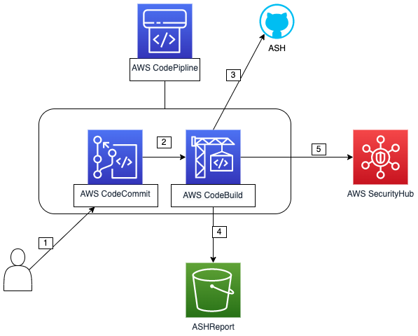

# Automated Security Helper Pipeline Template

The Automated Security Helper ([ASH](https://github.com/aws-samples/automated-security-helper)) pipeline CDK template, can be used to provision an end to end pipeline using CodePipeline, CodeCommit and CodeBuild.  
The solution will scan new commits using [ASH](https://github.com/aws-samples/automated-security-helper), will save the report into S3 bucket, and will alert to SecurityHub if the scan failed.




### Prerequisites
1. [SecurityHub configured](https://aws.amazon.com/security-hub/getting-started/)
2. [CDK](https://docs.aws.amazon.com/cdk/v2/guide/getting_started.html)

### Install
1. Clone this repo
2. Install pip requirements (recommended to create/use a dedicated virtual env)
3. ```cdk bootstap```
4. ```cdk deploy```(with default values) or ```cdk deploy --context repo_name=${repo_name_to_create}```


### Getting Started
1. Push your code into the CodeCommit repository
2. Wait
3. Review the report stored in S3
4. You will get a SecurityHub alert in case the scan will fail.

## Security
See [CONTRIBUTING](CONTRIBUTING.md#security-issue-notifications) for more information.

## License
This library is licensed under the Apache 2.0 License. See the LICENSE file.

© 2022 Amazon Web Services, Inc. or its affiliates. All Rights Reserved.

This AWS Content is provided subject to the terms of the AWS Customer Agreement
available at http://aws.amazon.com/agreement or other written agreement between
Customer and either Amazon Web Services, Inc. or Amazon Web Services EMEA SARL or both.